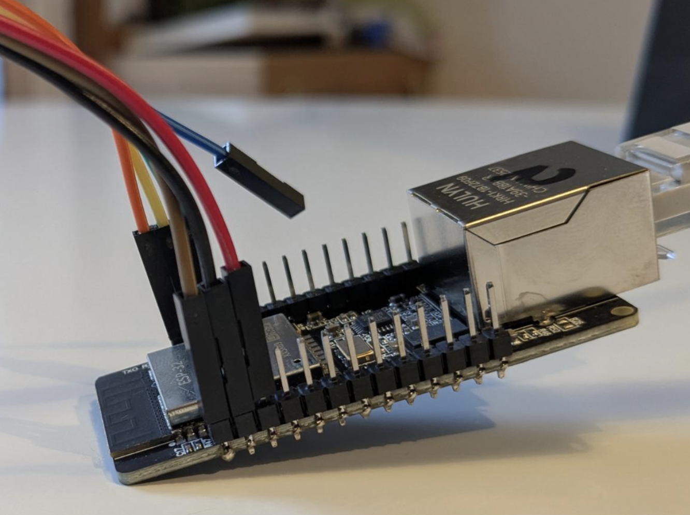
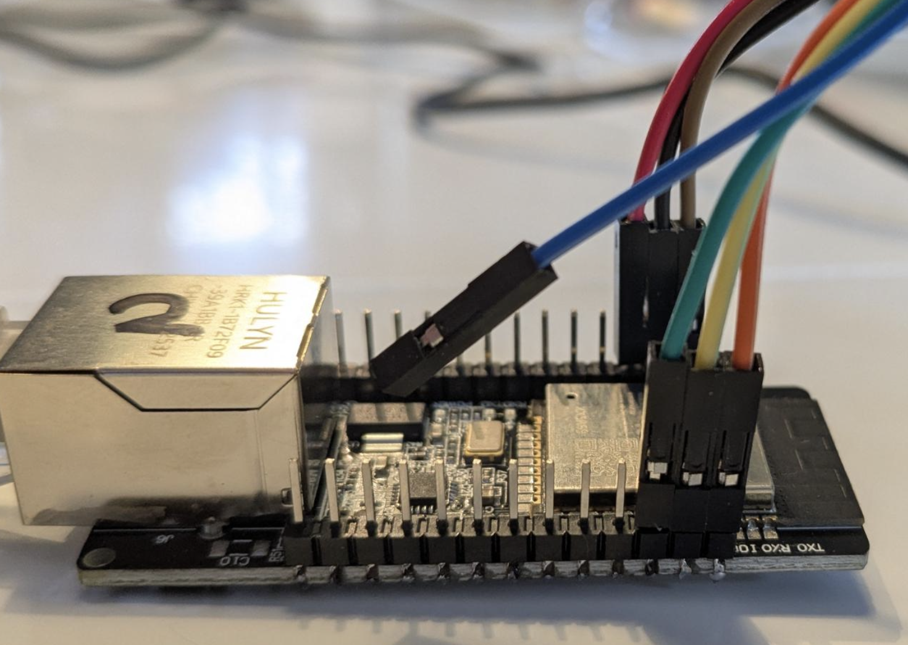
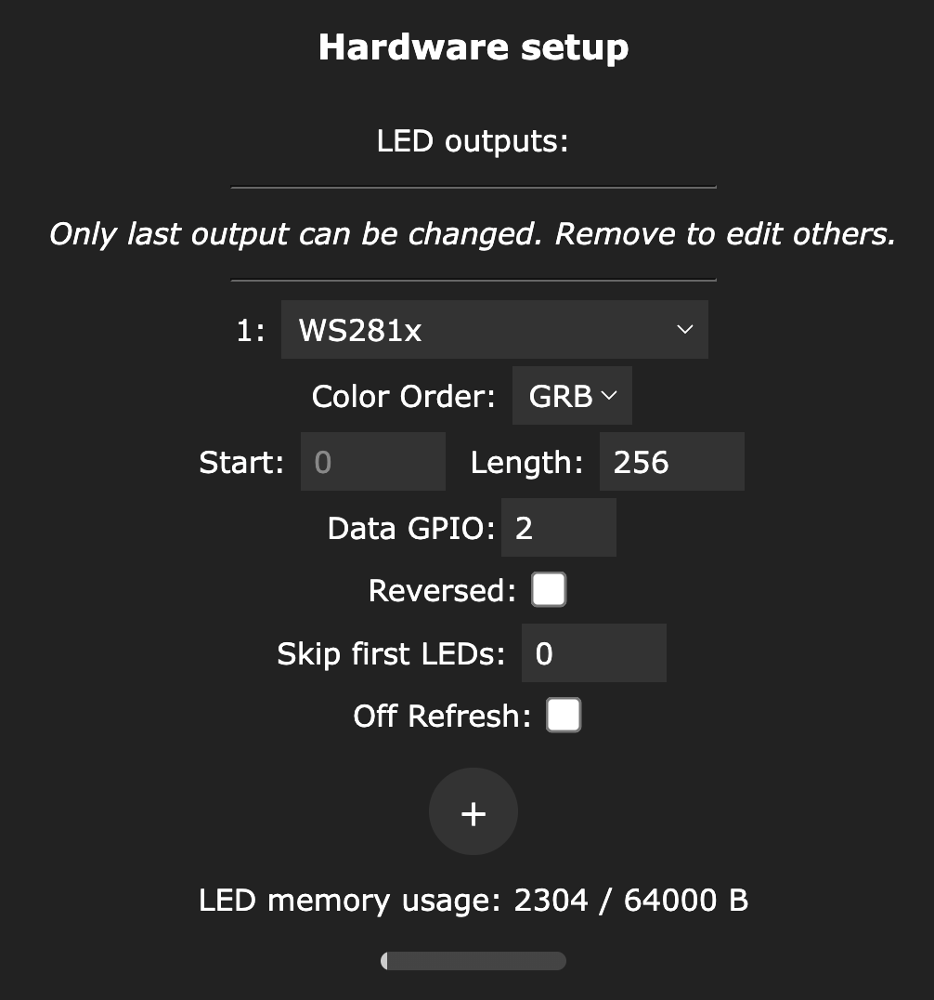
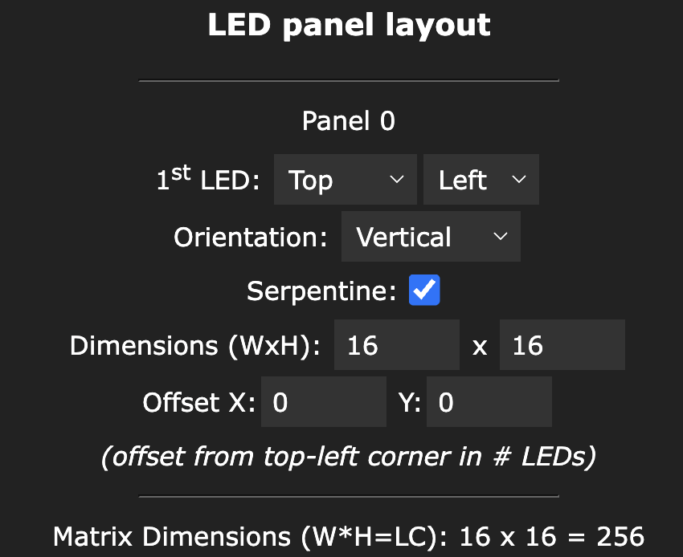
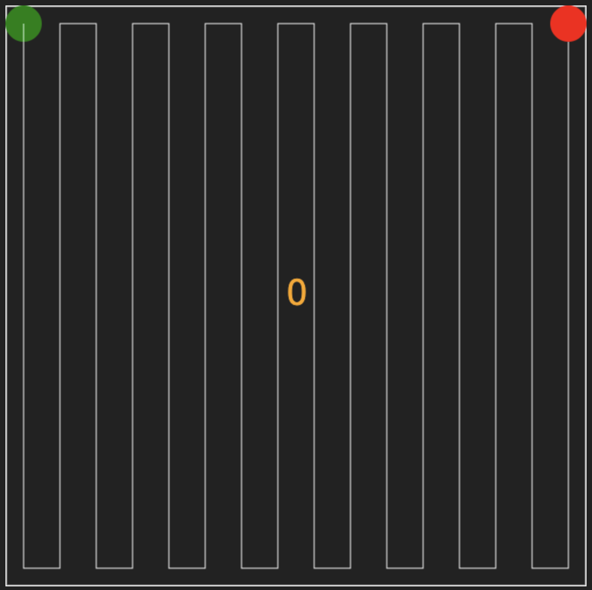
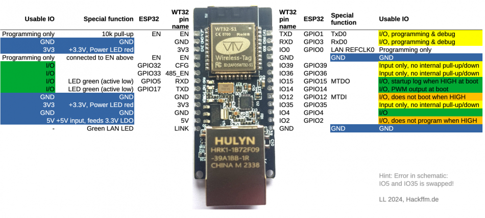
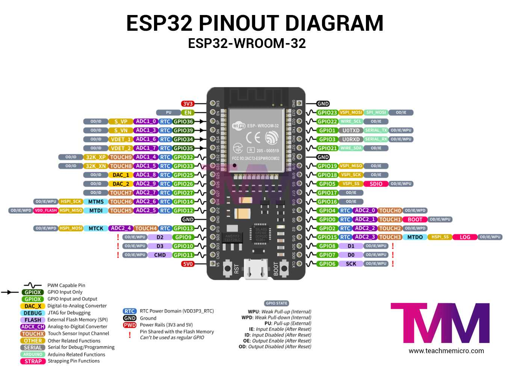

# Info for WT32-ETH01

## Programmer pins FTDI programmer WT32-ETH01

| FTDI pin | Wire color | WT32-ETH01 PIN |
| -------- | ---------- | -------------- |
| 3.3V | Red    | 3.3V |
| GND  | Black  | GND |
| DTR  | Green  | IO0 |
| RTS  | Brown  | EN |
| RX   | Orange | TX |
| TX   | Yellow | RX |

## Install WLED
1. Go to https://install.wled.me/ 
2. Select the most recent version *(0.15.3) is probably already selected*
3. Choose the `Ethernet` option next to `Plain` version
4. Press `Install`
5. Select the `FT232R USB UART` device
6. Click `Install` and select to erase the content
7. Wait till WLED is installed on the controller
8. Close the installer

## Configure WLED for Pixel Mini

### Connect to WLED
1. Disconnect and connect the USB cable to reset the controller
2. Navigate to your wifi networks
3. Connect to the `WLED-AP` access point
4. If a password is required, use `wled1234`
4. A popup screen should appear with the WLED software. If not. Browse to http://4.3.2.1

### LED settings
1. Go to **To the controls**
2. Go to **Config**
3. Select **LED Preferences** http://4.3.2.1/settings/leds 
4. Disable `Automatic Brightness limiter`
5. Press `+` on the **Hardware setup**
6. Set the **Length** to `256` leds

7. **Data GPIO**: `4`
8. In the **Defaults** topic set **Default brightness** to `20`
9. Press **Save** 

### 2D led settings
1. Go to the **2D Led configuration** http://4.3.2.1/settings/2D
2. Set `2D Matrix` at the **Strip or panel** option
3. Orientation: `Vertical`
4. Select `Serpentine`
5. Set the dimensions to `16x16 `
6. Press **Save**

### Sync interfaces
1. Go to the **Sync Interface** http://4.3.2.1/settings/sync
2. Set **Type** in the **Network DMX input** to `Art-net`
3. Press **Save**

### Network settings
1. Select **Wifi Setup** http://4.3.2.1/settings/wifi
2. Set the **mDNS address**: `pixel-mini-XX` *(XX is the number of the block)* 
> Example: the total address will become http://pixel-mini-02.local
3. **AP SSID**: `PIXELXX-AP` *(eg: PIXEL02-AP)*
4. **AP Password**: `Pixel1234`
5. **Ethernet Type**: `WT32-ETH01`
6. Press **Save and Connect**
7. Write the number you used for the AP on the ethernet port with a marker.

> After applying the network settings, the connection to WLED will be broken. You need to connect to the new AP SSID name `PIXELXX-AP` to continue working on the configuration.

## Pins I can use for WLED safely
Pins: 2, **4** *(default pin)*, 5, 12, 17 --> So yes, only these 5!! With a maximum of 2 16x16 screens per pin, this amounts to enough pins for the:
- NM Pixel Mini with 1 screen
- NM Pixel Medium with 4 screens

## PCB help
Standard GPIO pin for the leds is 4

## Pin layout

